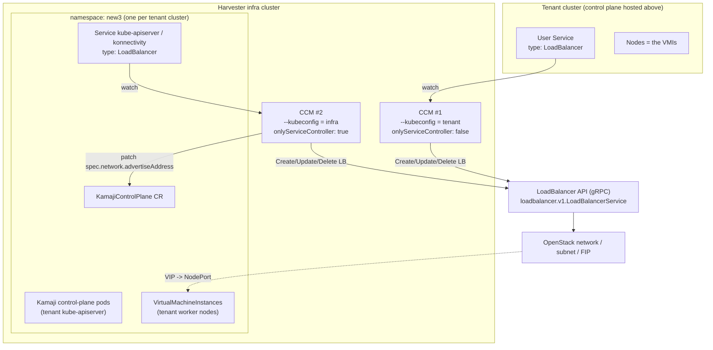
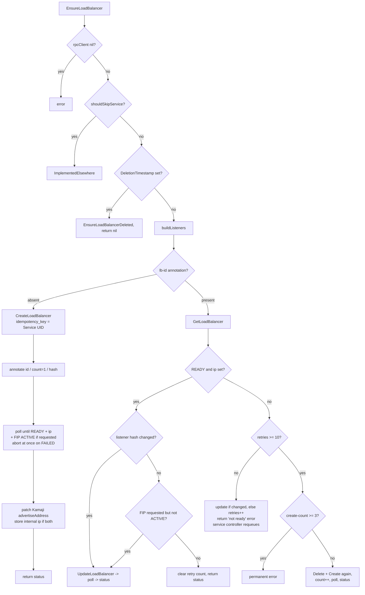

# Architecture

## 1. Problem statement

Upstream `cloud-provider-kubevirt` implements `type: LoadBalancer` by creating a
*mirror* Service in the infra (KubeVirt) cluster and letting the infra cluster's
own load balancer (kube-vip / MetalLB / cloud LB) expose it. That model requires
the infra cluster to own an LB implementation and produces one infra Service per
tenant Service.

In this deployment the load balancers are provisioned by an **external
LoadBalancer API** (a gRPC service backed by OpenStack Octavia-style resources:
networks, subnets, floating IPs, listeners, health monitors). The CCM's job is
reduced to translating Kubernetes `Service` objects into `LoadBalancer` RPCs and
writing the resulting IP back into `service.status`.

**No Kubernetes object is created by the load balancer path any more** — the only
writes the CCM makes are annotations on the Service, the Service status, and (in
infra mode) a patch to a `KamajiControlPlane`.

## 2. Topology



Key points:

* The tenant cluster's **control plane runs as pods on the infra cluster**
  (Kamaji). Its API server therefore needs an externally reachable address that
  is *not* a NodePort of the infra cluster — hence CCM #2.
* The tenant cluster's **worker nodes are KubeVirt VMs** on the same infra
  cluster. Their internal IPs are what the LoadBalancer API uses as backends.
* Both CCM instances run **in the infra cluster** and both talk to the same
  LoadBalancer API.

## 3. The two clients inside the CCM

`pkg/provider/cloud.go` builds two controller-runtime clients, and it is easy to
misread their names:

| Field | Built from | Points at |
|-------|-----------|-----------|
| `Cloud.client` (`loadbalancer.client`) | cloud-config `kubeconfig:` key, or **in-cluster config** when that key is empty | The **infra** cluster (the cluster the CCM pod runs in). Used only to list `VirtualMachineInstance`s for the backend fallback. |
| `Cloud.tenantClient` (`loadbalancer.tenantClient`) | the `--kubeconfig` flag, via the standard `cloud-controller-manager` client builder | The cluster whose Services this CCM manages. In mode 1 that is the **tenant** cluster; in mode 2 it is the **infra** cluster itself. |

So in `onlyServiceController: true` mode, "tenantClient" is the infra-cluster
client — that is what makes the `KamajiControlPlane` patch and the annotation
writes on the control-plane Services land in the right cluster.

The Helm chart leaves `kubeconfig:` unset in the ConfigMap, so `client` always
resolves through in-cluster config, and mounts the kubeconfig for `--kubeconfig`
from the Secret `{{ .Values.clusterName }}-kubeconfig`.

## 4. Deployment mode 1 — tenant workload LoadBalancers

`onlyServiceController: false` (default).

* All CCM controllers run: `cloud-node`, `cloud-node-lifecycle`, `service`
  (and `instancesV2` provides node metadata from the VMIs). Node addresses are
  every routable IP of the VMI's `default` interface — the guest agent also
  reports the kernel's link-local address there, which is filtered out; see §8.
* Network/subnet/tenant IDs come from **cloud-config** (`networkID`, `subnetID`,
  `tenantID`, `fipNetworkID`, `ipType`).
* RBAC is a namespaced `Role`/`RoleBinding` covering `virtualmachines`,
  `virtualmachineinstances`, `pods`, `nodes`, `services`, `endpoints`.
* A tenant user creates `type: LoadBalancer`; the CCM builds one listener per
  Service port with the tenant nodes' internal IPs and the port's **NodePort**
  as backends, and publishes the floating IP in `status.loadBalancer`.

## 5. Deployment mode 2 — Kamaji control-plane Services on the infra cluster

`onlyServiceController: true`. This mode is the main local addition and changes
four behaviours.

### 5.1 Only the service controller runs

The Deployment adds:

```
--controllers=*,-cloud-node-controller,-cloud-node-lifecycle-controller,-node-route-controller
```

The infra cluster already has its own cloud provider / node management; this CCM
must not touch infra nodes. Only the service controller is left active.

### 5.2 Per-Service network configuration via annotations

A single CCM instance serves control-plane Services for *many* tenant clusters,
each of which may live on a different OpenStack network/subnet/project. Global
cloud-config values cannot express that, so in this mode the values are read
from the Service itself:

| Annotation | Falls back to |
|------------|---------------|
| `loadbalancer.kubevirt.io/network-id` | *(required — no fallback)* |
| `loadbalancer.kubevirt.io/subnet-id` | *(required — no fallback)* |
| `loadbalancer.kubevirt.io/tenant-id` | the Service's namespace |
| `loadbalancer.kubevirt.io/ip-type` | cloud-config `ipType` |

A Service missing `network-id` **or** `subnet-id` is skipped:
`EnsureLoadBalancer` returns `cloudprovider.ImplementedElsewhere` and
`GetLoadBalancer` returns `exists = false`, so unrelated LoadBalancer Services in
the infra cluster are left completely alone. (`fipNetworkID` is still taken from
cloud-config in all modes.)

### 5.3 `KamajiControlPlane.spec.network.advertiseAddress`

After the LB becomes ready, if the Service carries the label
`kamaji.clastix.io/name`, the CCM merge-patches the `KamajiControlPlane` of that
name in the Service's namespace:

```yaml
spec:
  network:
    advertiseAddress: <LoadBalancer.ip>   # the *internal* VIP, never the FIP
```

Kamaji propagates `advertiseAddress` into the tenant kubeconfig / kubelet
bootstrap. Advertising the floating IP would force every kubelet–apiserver
conversation to hairpin out through the external network; advertising the
internal VIP keeps that traffic inside the tenant network. This patch is applied
in *all* ip-types (including `external`, where the published status is still the
FIP) precisely because the two addresses serve different consumers:

* `status.loadBalancer.ingress[0].ip` → FIP, for humans/CI reaching the API server;
* `advertiseAddress` → internal VIP, for kubelets.

### 5.4 `ipMode: Proxy` for internal IPs

For `ip-type: internal` in this mode the status is published as:

```yaml
status:
  loadBalancer:
    ingress:
      - ip: 10.x.y.z
        ipMode: Proxy
```

With the default `ipMode: VIP`, kube-proxy installs a local DNAT short-circuit
for the LB IP on every node. Internal VIPs are allocated per-VPC, so the *same*
address can legitimately belong to two different load balancers on two different
VPC subnets that happen to share a CIDR. The local DNAT would then hijack traffic
meant for the other VPC's LB. `ipMode: Proxy` tells kube-proxy to leave the
address alone and send packets to the load balancer, which is the authority on
where they belong. `ipMode` stays `VIP` for `external`/`both`, and for every
Service in mode 1.

## 6. IP / FIP model

`ipType` (cloud-config) or `loadbalancer.kubevirt.io/ip-type` (mode 2) takes one
of three values:

| Value | FIP requested | `status…ingress[0].ip` | `ipMode` | Extra |
|-------|---------------|------------------------|----------|-------|
| `external` (default, also used when empty) | yes | the FIP | `VIP` | — |
| `internal` | no | the internal VIP | `Proxy` in mode 2, `VIP` in mode 1 | — |
| `both` | yes | the FIP | `VIP` | internal VIP stored in annotation `kubevirt.io/loadbalancer-internal-ip` |

When a FIP is requested the create request sets `fip: ""` (auto-allocate) plus
`fip_network_id` from cloud-config; creation is rejected up front if
`fipNetworkID` is unset. Readiness polling additionally waits for
`fip_state == FIP_STATE_ACTIVE` whenever a FIP was requested.

## 7. Reconciliation

State lives entirely in Service annotations, so the controller is restart-safe
except for the in-memory retry counter.

| Annotation | Written by | Purpose |
|------------|-----------|---------|
| `kubevirt.io/loadbalancer-id` | CCM | LB UUID returned by `CreateLoadBalancer`; the handle for update/delete |
| `kubevirt.io/loadbalancer-listener-hash` | CCM | SHA-256 of the marshalled desired listener list (before server-assigned ids are grafted on); drives change detection |
| `kubevirt.io/loadbalancer-create-count` | CCM | How many times this Service's LB has been (re)created |
| `kubevirt.io/loadbalancer-internal-ip` | CCM | Internal VIP when `ip-type: both` |

### `EnsureLoadBalancer`



Because `EnsureLoadBalancer` **blocks** while polling (up to
`creationPollTimeout`), the service controller's worker is occupied for the whole
provisioning window. `concurrentServiceSyncs` in the chart exists to provision
several load balancers in parallel.

### `UpdateLoadBalancer`

Called by the service controller when the node set changes — for **every**
LoadBalancer Service, not just the ones the node affects. It rebuilds the
listeners (i.e. fresh backend IPs) and returns without any RPC when the resulting
hash matches the annotation, which is the common case. When the config really did
change it reads the current load balancer, grafts the server-assigned ids onto the
new listeners (see below), sends `UpdateLoadBalancer` with the full listener list,
and records the new hash. It requires the `loadbalancer-id` annotation to exist,
unless the Service is one `shouldSkipService` declines.

### `EnsureLoadBalancerDeleted`

If the annotation is missing (e.g. it was never persisted), the CCM falls back to
`ListLoadBalancers` filtered by tenant, paging through the results, and matches on
the generated LB name (`cloudprovider.DefaultLoadBalancerName(service)` —
`a<uid>` with dashes stripped). `NOT_FOUND` from the delete call is treated as
success, so deletion is idempotent. A missing RPC client or a failed lookup is
reported as an error rather than as success, because the service controller drops
its cleanup finalizer as soon as this returns nil.

## 8. Listener construction

One listener per Service port, each carrying exactly **one rule** with exactly
**one backend**:

```
Listener(port, protocol)
└── ListenerRule(algorithm, matches, health_monitor)
    └── RuleBackend(name: "default", weight: 1)
        └── BackendRef(ip: <node ip>, port: <node port>) x N
```

The API supports several rules per HTTP listener (selected by `matches`) and
several weighted backends per rule. A Kubernetes Service has nothing to express
with either, and TCP/UDP listeners are restricted to a single match-less rule
anyway, so the CCM always emits this one shape.

* `port` = `ServicePort.Port`, `tls_enabled` = false, `hostnames` empty.
* **Protocol**: `UDP` for a UDP `ServicePort`; otherwise `HTTP` if the Service has
  the `kubevirt.io/http-path` annotation, else `TCP`. The annotation is
  Service-wide, so it applies to every eligible port of that Service.
* **Rule**: `algorithm` = `ROUND_ROBIN`, `priority` 0 (the API auto-assigns).
* **HTTP rules** get one `HttpRouteMatch` (`path` + `PathType: PREFIX`, and
  `method` from `kubevirt.io/http-method`) plus a health monitor with
  `http_health_check_path`, `http_health_check_method` and
  `expected_status_codes: [200]` — the API requires all three on an HTTP listener
  that has a health monitor. If neither annotation carries a value the match list
  is left empty, which is the API's catch-all; an *empty match* would be rejected.
* **Backend**: `name: "default"`, `weight: 1`. The weight is explicit because the
  API rejects a rule whose backends all have weight 0, before its own "unset means
  1" default can apply.
* **Health monitor defaults** (both protocols): interval 10s, timeout 5s,
  unhealthy threshold 3, healthy threshold 2. The API enforces
  `timeout < interval`.
* **Endpoints**: for every node, each `NodeInternalIP` paired with the port's
  **NodePort**. The node list comes from the service controller, i.e. the nodes
  of whichever cluster this CCM watches — tenant worker VMIs in mode 1, infra
  cluster nodes in mode 2. If no node has an internal IP, `NodeExternalIP` is
  tried. If the node list is empty altogether, the CCM lists
  `VirtualMachineInstance`s in its own namespace labelled
  `cluster.x-k8s.io/role=worker` and `cluster.x-k8s.io/cluster-name=<clusterName>`
  and uses each one's `default` interface — the pod network; the rest belong to
  whatever CNI runs inside the guest. The result is deduplicated (the API rejects
  a backend listing the same `ip:port` twice) and sorted. If a port ends up with
  no endpoints at all the reconcile fails with that reason rather than sending a
  request the API would reject.
* **Only routable addresses become endpoints.** Link-local, loopback and
  unspecified addresses are dropped, from node addresses and from VMI interfaces
  alike. The kernel gives every IPv6-capable NIC a link-local address derived
  from its own MAC, so the guest agent reports one next to the real address; it
  is valid only on the local segment, and the datapath rejects the whole load
  balancer rather than just that endpoint. `InstancesV2` applies the same filter
  when it populates `node.status.addresses` (§4), so in mode 1 a link-local never
  reaches the Node in the first place — the filter here also covers mode 2, where
  the node list comes from the infra cluster's own cloud provider.

The listener list is hashed, so a node joining or leaving changes the hash and
triggers an `UpdateLoadBalancer` on the next sync. Sorting the endpoints keeps a
merely reordered node list from looking like a change.

### Identifier preservation on update

`UpdateLoadBalancer` replaces the listener list wholesale, and the API reconciles
it **by id alone**: a listener, rule or backend sent without a known id is created
fresh and the row it replaces — together with the data plane objects generated
from it — is deleted. Since updates fire on every node change, the CCM reads the
current load balancer first and grafts the existing listener, rule and backend ids
onto the new listeners, matching by port and protocol. Only the endpoint list then
moves; everything else is updated in place.

Load-balancer-level spec fields are fixed: `client_conn_limit: 0` (platform
default), `security_group_disabled: true`, `qos_policy_disabled: true`.

## 9. RPC client

`pkg/rpc/loadbalancer/client.go` wraps the generated stub with:

* **Per-attempt deadline** — each attempt runs under `Config.Timeout`
  (`rpcKeepAlive`, default 30s). Calls use `grpc.WaitForReady(true)`, so without
  a deadline an unreachable server would block for the lifetime of the caller's
  context and stall the service controller. If the *caller's* context ends, the
  loop stops and reports that rather than retrying.
* **Retry** — up to `rpcRetryMax` extra attempts with exponential backoff
  (`RetryDelay << attempt` plus jitter, capped at 5s). Retried on `UNAVAILABLE`,
  `CANCELED`, `DEADLINE_EXCEEDED` and unknown non-status errors; returned
  immediately on `NOT_FOUND`, `ALREADY_EXISTS`, `INVALID_ARGUMENT`,
  `PERMISSION_DENIED`. Worst-case blocking per RPC is therefore roughly
  `(rpcRetryMax + 1) x rpcKeepAlive`.
* **Connection recovery** — before each attempt the connection state is checked
  and `ResetConnectBackoff` + `WaitForStateChange` are used to wait out a server
  restart; calls also use `grpc.WaitForReady(true)`.
* **Auth** — when `apiKey` is set, per-RPC credentials add
  `authorization: Bearer <apiKey>`. Transport is plaintext (`insecure`), so the
  API key only protects against unauthorised callers, not eavesdropping.
* **Error translation** — `ToRPCError` maps gRPC codes to user-facing messages
  that surface as Service events.

`CreateLoadBalancer` is idempotent server-side via `idempotency_key`. The key is
derived from the Service UID **and the create attempt number**: the first attempt
uses the UID verbatim, later attempts use a v5 UUID derived from it. Retrying one
attempt therefore replays instead of leaking a second load balancer, while the
recreate path gets a genuinely new key — reusing the UID there would make the
server replay the previous, already-deleted creation and the recreate would
silently do nothing.
